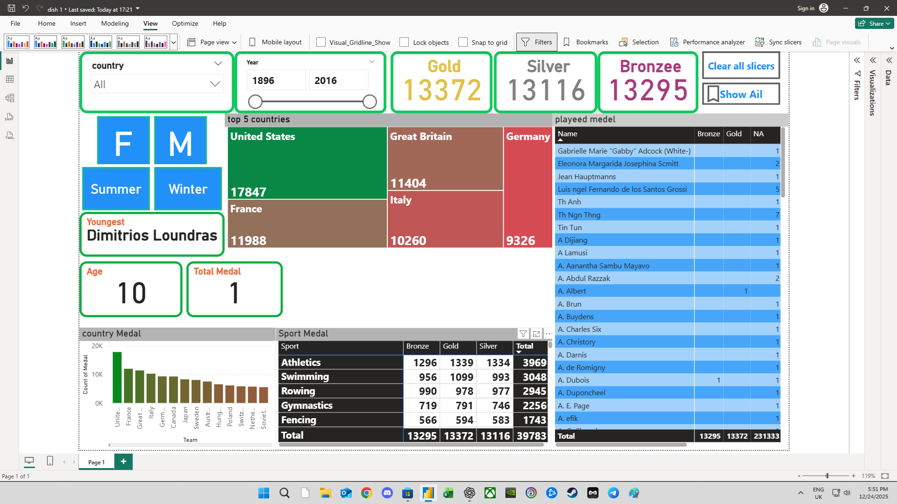
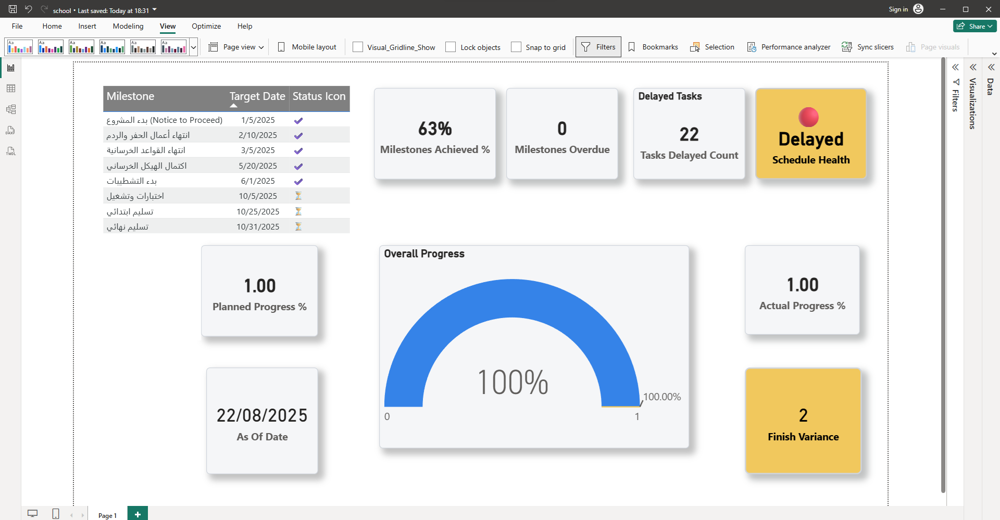

<h1 align="center">Hi 👋, I'm Mohammed fahad</h1>
<h3 align="center">Aspiring Data Analyst | Excel & Power BI Enthusiast</h3>

- 🔭 I’m currently working on **sales Data Analysis using Excel & Power BI**

- 🌱 I’m currently learning **Power BI DAX, Advanced Excel, SQL Basics**

- 👯 I’m looking to collaborate on **Data Analysis Projects (Excel, Power BI, Business Insights)**

- 🤝 I’m looking for help with **Improving DAX measures and real-world business scenarios**

- 💬 Ask me about **Excel, Data Cleaning, Dashboards, KPIs**

- 📫 How to reach me **Mohammed.Fahad.3th@gmail.com**

<h3 align="left">Connect with me:</h3>

----------------------------------------------------------------------------------------------------------------------------------------------------------------------------------------------------------------------

🏅 Olympic Games Medal Analysis Dashboard

 📌 Overview
This Power BI dashboard provides an analytical view of Olympic medal performance across countries, sports, and Olympic seasons (Summer & Winter). It enables data-driven insights into medal distribution, top-performing nations, and athlete-level achievements.

  Dashboard Preview

🔎 Key Insights
- Medal distribution by country
- Top 5 medal-winning countries
- Medal breakdown by sport (Gold, Silver, Bronze)
- Athlete-level medal details
- Historical trends across Olympic years

🛠 Tools Used
- Power BI
- Microsoft Excel

---------------------------------------------------------------------------------------------------------------------------------------------------------------------------------------------------------------------
---

📅 Project Schedule Health Dashboard

📌 Overview
This Power BI dashboard provides a clear view of project schedule health by tracking milestones, overdue items, delayed tasks, and comparing planned vs actual progress. It helps stakeholders quickly spot risks and take action based on data.

 Dashboard Preview

🔎 Key Highlights
- Milestones Achieved (%)
- Milestones Overdue
- Delayed Tasks
- Planned vs Actual Progress
- Overall Schedule Health Indicator

🛠 Tools Used
- Power BI
- Microsoft Excel

